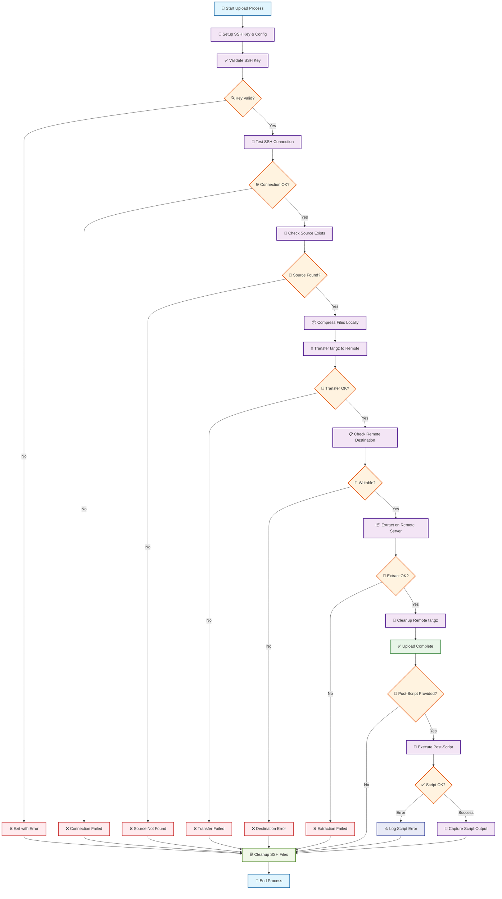
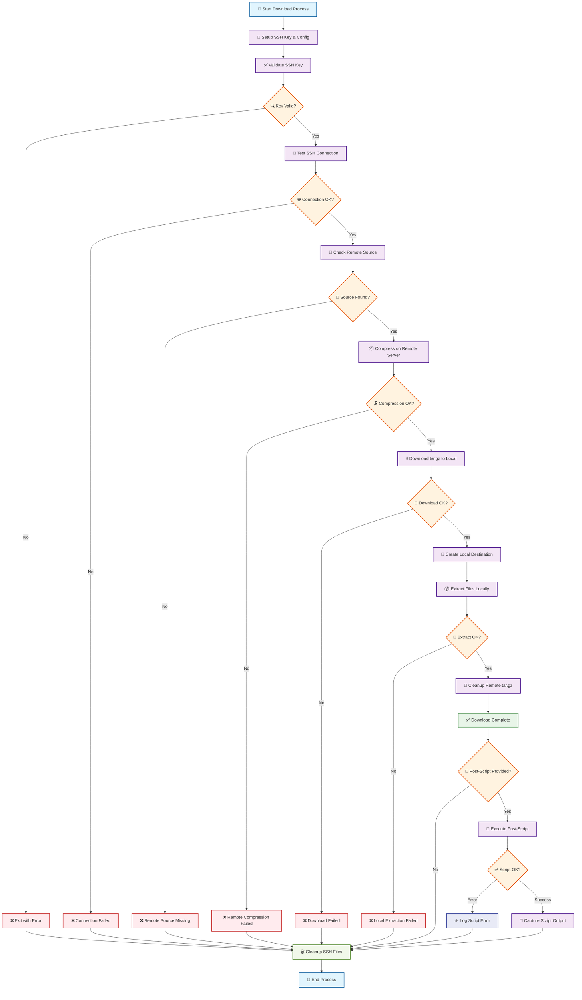

# sshft (SSH File Transfer)

This action allows you to transfer files or directories to and from a remote server via SSH. It uses compression (tar.gz) for efficient transfer and includes comprehensive error handling and security features.

## Inputs

| Name                     | Description                                 | Required | Default  |
|--------------------------|---------------------------------------------|----------|----------|
| `host`                   | SSH host to connect to                      | Yes      | -        |
| `port`                   | SSH port                                    | No       | 22       |
| `username`               | SSH username                                | Yes      | -        |
| `key`                    | SSH private key                             | Yes      | -        |
| `passphrase`             | Passphrase for the SSH private key          | No       | -        |
| `source`                 | Source file or directory to transfer        | Yes      | -        |
| `destination`            | Destination path on the remote server       | Yes      | -        |
| `direction`              | Transfer direction (`upload` or `download`) | No       | `upload` |
| `recursive`              | Transfer files recursively                  | No       | `true`   |
| `strict_host_key_checking` | Enable strict host key checking           | No       | `true`   |
| `post_script`            | Inline script to run on remote after transfer | No     | -        |
| `post_script_path`       | Path to script on remote to run after transfer | No   | -        |

## Example Usage

### Uploading Files to Server

```yaml
jobs:
  deploy:
    runs-on: ubuntu-latest
    steps:
      - uses: actions/checkout@v4
      - name: Transfer files to server
        uses: kellydc/sshft@v1
        with:
          host: ${{ secrets.SSH_HOST }}
          username: ${{ secrets.SSH_USERNAME }}
          key: ${{ secrets.SSH_PRIVATE_KEY }}
          source: "dist/"
          destination: "/var/www/html/"

      - name: Transfer single file
        uses: kellydc/sshft@v1
        with:
          host: ${{ secrets.SSH_HOST }}
          username: ${{ secrets.SSH_USERNAME }}
          key: ${{ secrets.SSH_PRIVATE_KEY }}
          source: "config.json"
          destination: "/etc/myapp/config.json"
```

### Downloading Files from Server

```yaml
jobs:
  backup:
    runs-on: ubuntu-latest
    steps:
      - name: Download logs from server
        uses: kellydc/sshft@v1
        with:
          host: ${{ secrets.SSH_HOST }}
          username: ${{ secrets.SSH_USERNAME }}
          key: ${{ secrets.SSH_PRIVATE_KEY }}
          source: "/var/log/application.log"
          destination: "./logs/"
          direction: "download"
          
      - name: Download database backup
        uses: kellydc/sshft@v1
        with:
          host: ${{ secrets.SSH_HOST }}
          username: ${{ secrets.SSH_USERNAME }}
          key: ${{ secrets.SSH_PRIVATE_KEY }}
          source: "/var/backups/db/"
          destination: "./backups/"
          direction: "download"
          recursive: true
```

### Advanced Options

```yaml
jobs:
  deploy:
    runs-on: ubuntu-latest
    steps:
      - name: Transfer with custom port
        uses: kellydc/sshft@v1
        with:
          host: ${{ secrets.SSH_HOST }}
          port: 2022
          username: ${{ secrets.SSH_USERNAME }}
          key: ${{ secrets.SSH_PRIVATE_KEY }}
          source: "dist/"
          destination: "/var/www/html/"
          
      - name: Transfer to new server without key verification
        uses: kellydc/sshft@v1
        with:
          host: ${{ secrets.NEW_SSH_HOST }}
          username: ${{ secrets.SSH_USERNAME }}
          key: ${{ secrets.SSH_PRIVATE_KEY }}
          source: "config/"
          destination: "/etc/myapp/"
          strict_host_key_checking: false # Disable for first connection
          
      - name: Transfer with SSH key passphrase
        uses: kellydc/sshft@v1
        with:
          host: ${{ secrets.SSH_HOST }}
          username: ${{ secrets.SSH_USERNAME }}
          key: ${{ secrets.SSH_PRIVATE_KEY }}
          passphrase: ${{ secrets.SSH_PASSPHRASE }}
          source: "sensitive_data/"
          destination: "/secure/location/"
```

### Post-Transfer Script Execution

Execute scripts on the remote server after successful file transfer. Scripts can be provided inline or reference an existing script on the remote server. Script execution is optional and includes robust error handling.

#### Inline Script Example

```yaml
jobs:
  deploy:
    runs-on: ubuntu-latest
    steps:
      - name: Deploy and restart service
        uses: kellydc/sshft@v1
        with:
          host: ${{ secrets.SSH_HOST }}
          username: ${{ secrets.SSH_USERNAME }}
          key: ${{ secrets.SSH_PRIVATE_KEY }}
          source: "dist/"
          destination: "/var/www/html/"
          post_script: |
            echo "Deployment completed at $(date)"
            sudo systemctl restart nginx
            echo "Service restarted successfully"
            
      - name: Deploy with permissions fix
        uses: kellydc/sshft@v1
        with:
          host: ${{ secrets.SSH_HOST }}
          username: ${{ secrets.SSH_USERNAME }}
          key: ${{ secrets.SSH_PRIVATE_KEY }}
          source: "app/"
          destination: "/opt/myapp/"
          post_script: |
            cd /opt/myapp
            chmod +x *.sh
            chown -R www-data:www-data /opt/myapp
```

#### Remote Script Path Example

```yaml
jobs:
  deploy:
    runs-on: ubuntu-latest
    steps:
      - name: Deploy and run deployment script
        uses: kellydc/sshft@v1
        with:
          host: ${{ secrets.SSH_HOST }}
          username: ${{ secrets.SSH_USERNAME }}
          key: ${{ secrets.SSH_PRIVATE_KEY }}
          source: "dist/"
          destination: "/var/www/html/"
          post_script_path: "/opt/scripts/post-deploy.sh"
          
      - name: Deploy with custom maintenance script
        uses: kellydc/sshft@v1
        with:
          host: ${{ secrets.SSH_HOST }}
          username: ${{ secrets.SSH_USERNAME }}
          key: ${{ secrets.SSH_PRIVATE_KEY }}
          source: "updates/"
          destination: "/var/app/"
          post_script_path: "~/scripts/maintenance.sh"
```

#### Using Script Outputs

```yaml
jobs:
  deploy:
    runs-on: ubuntu-latest
    steps:
      - name: Deploy with post-script
        id: deploy
        uses: kellydc/sshft@v1
        with:
          host: ${{ secrets.SSH_HOST }}
          username: ${{ secrets.SSH_USERNAME }}
          key: ${{ secrets.SSH_PRIVATE_KEY }}
          source: "dist/"
          destination: "/var/www/html/"
          post_script: |
            echo "Server: $(hostname)"
            echo "Disk usage: $(df -h / | tail -n1 | awk '{print $5}')"
            
      - name: Display script output
        if: steps.deploy.outputs.script_executed == 'true'
        run: |
          echo "Script was executed successfully!"
          echo "Output: ${{ steps.deploy.outputs.script_output }}"
          
      - name: Handle script errors
        if: steps.deploy.outputs.script_error != ''
        run: |
          echo "Script error: ${{ steps.deploy.outputs.script_error }}"
```

## Features

- **Compression**: Files are automatically compressed using tar.gz for efficient transfer
- **Bidirectional**: Supports both upload and download operations
- **Security**: SSH key validation, configurable host key checking, and secure cleanup
- **Error Handling**: Comprehensive error checking at each step
- **Connection Testing**: Verifies SSH connection before attempting file transfer
- **Temporary File Management**: Automatic cleanup of temporary files on both local and remote systems
- **Post-Transfer Scripts**: Optional script execution after successful file transfer with robust error handling

## Data Workflow

Understanding how the action processes your files can help you plan your deployments and troubleshoot issues. Below are the detailed workflows for both upload and download operations.

### Upload Workflow (Local → Remote)



### Download Workflow (Remote → Local)



### Key Process Details

- **Compression**: Both workflows use tar.gz compression to reduce transfer time and handle complex directory structures
- **Error Handling**: Each critical step includes validation with immediate error reporting
- **Security**: SSH keys are validated before use and securely cleaned up afterward
- **Cleanup**: Temporary files are automatically removed from both local and remote systems
- **Connection Testing**: SSH connectivity is verified before attempting file operations
- **Post-Script Execution**: Optional scripts run after successful transfer with graceful error handling that doesn't fail the action

## Post-Script Error Handling

The post-transfer script feature includes comprehensive error handling to ensure reliability:

- **Script Validation**: 
  - Inline scripts are checked for emptiness and basic syntax
  - Remote scripts are verified to exist and be readable before execution
  - Bash syntax validation is performed before execution
  
- **Graceful Failure**: 
  - Script execution failures do NOT fail the entire action
  - Clear error messages are provided if scripts are malformed or non-existent
  - Script errors are captured in the `script_error` output
  
- **Security**:
  - Inline scripts are uploaded to temporary files with unique names
  - Temporary script files are automatically cleaned up after execution
  - Scripts are executed with proper permissions
  - Non-executable scripts are run with bash interpreter
  
- **Output Handling**:
  - Script output is captured and sanitized
  - Output is truncated to 10KB to prevent workflow log overflow
  - All script output is available via the `script_output` output variable

### Common Script Error Messages

| Error Message                     | Cause                                          | Solution                                    |
|-----------------------------------|------------------------------------------------|---------------------------------------------|
| `Script is empty or malformed`    | Inline script contains only whitespace         | Provide a valid script with commands        |
| `Script appears malformed`        | No recognizable shell commands found           | Ensure script contains valid bash commands  |
| `Script file does not exist`      | Remote script path is incorrect                | Verify the path on the remote server        |
| `Script file is not readable`     | Permission issues with remote script           | Check file permissions on remote server     |
| `Script is malformed (syntax errors)` | Bash syntax validation failed              | Fix syntax errors in the script             |
| `Script execution failed`         | Script returned non-zero exit code             | Debug script logic and check error logs     |
| `Failed to upload script file`    | Network or permission issues                   | Check SSH connection and permissions        |

## Security Notes

- Always store your SSH private key as a GitHub secret.
- SSH private keys are validated before use to ensure they are properly formatted.
- By default, host key verification is enabled for security. Only disable `strict_host_key_checking` when necessary.
- All SSH keys and configurations are created with unique filenames to avoid conflicts with existing SSH setups.
- The action securely cleans up all temporary SSH files after execution, including overwriting key files with zeros.
- SSH connections include timeout and keep-alive settings for reliability.
- Supports SSH key passphrases for additional security.
- **Post-script security**: Inline scripts are uploaded securely and temporary files are cleaned up automatically.

## Outputs

| Name              | Description                                      |
|-------------------|--------------------------------------------------|
| `success`         | File transfer was successful                     |
| `error`           | Error message on failure                         |
| `script_executed` | Whether a post-transfer script was executed      |
| `script_output`   | Output from the post-transfer script execution   |
| `script_error`    | Error message if script execution failed         |
