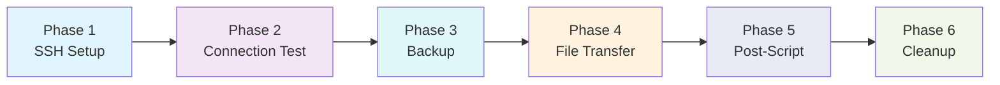
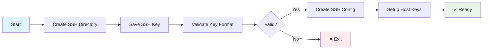
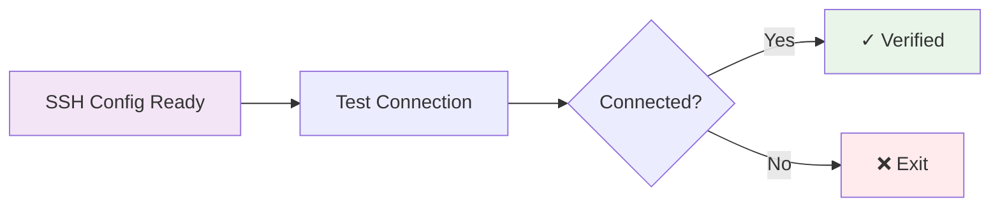
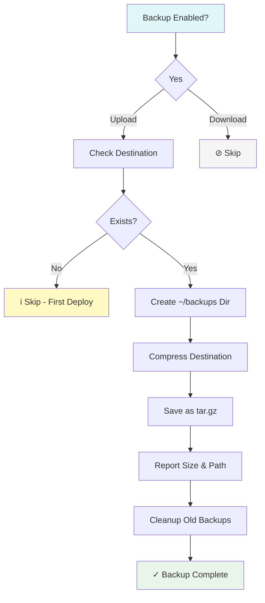
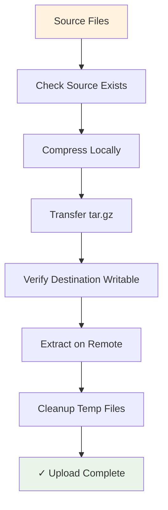
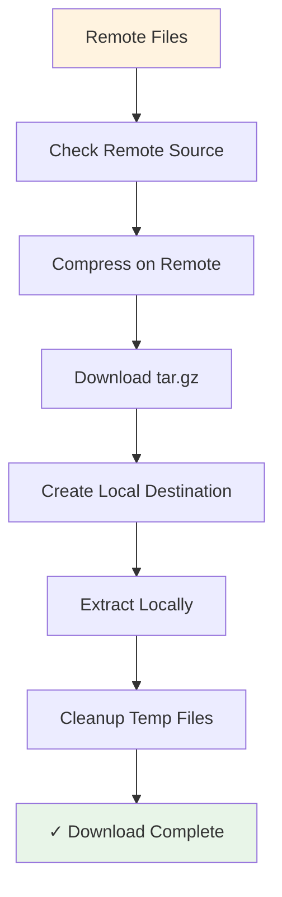
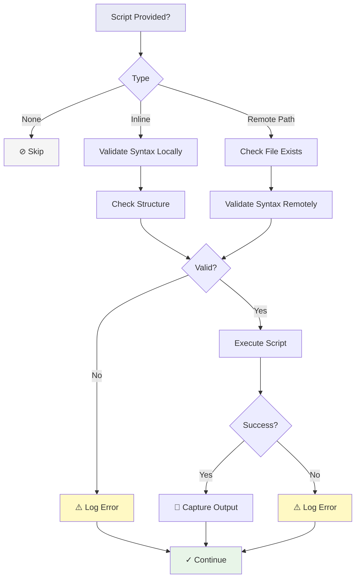
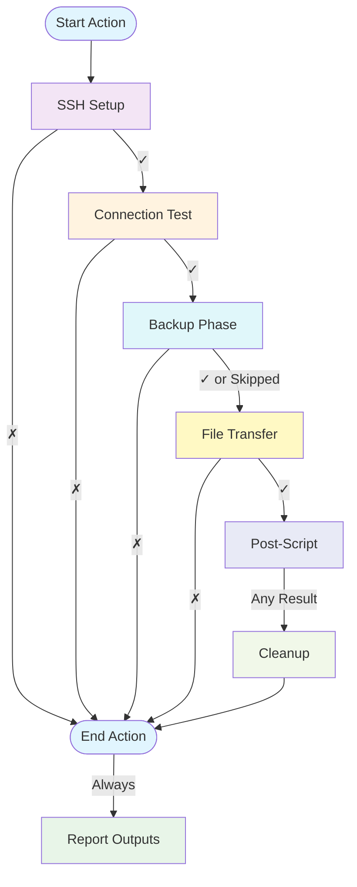

# sshft (SSH File Transfer)

> 📚 **[Documentation Index](DOCS_INDEX.md)** - Complete guide to all documentation

This action allows you to transfer files or directories to and from a remote server via SSH. It uses compression (tar.gz) for efficient transfer and includes comprehensive error handling and security features.

## Inputs

| Name                     | Description                                 | Required | Default  |
|--------------------------|---------------------------------------------|----------|----------|
| `host`                   | SSH host to connect to                      | Yes      | -        |
| `port`                   | SSH port                                    | No       | 22       |
| `username`               | SSH username                                | Yes      | -        |
| `key`                    | SSH private key                             | Yes      | -        |
| `passphrase`             | Passphrase for the SSH private key          | No       | -        |
| `source`                 | Source file or directory to transfer        | Yes      | -        |
| `destination`            | Destination path on the remote server       | Yes      | -        |
| `direction`              | Transfer direction (`upload` or `download`) | No       | `upload` |
| `recursive`              | Transfer files recursively                  | No       | `true`   |
| `strict_host_key_checking` | Enable strict host key checking           | No       | `true`   |
| `post_script`            | Inline script to run on remote after transfer | No     | -        |
| `post_script_path`       | Path to script on remote to run after transfer | No   | -        |
| `backup_before_transfer` | Create backup of destination before transfer | No    | `true`   |

## Example Usage

### Uploading Files to Server

```yaml
jobs:
  deploy:
    runs-on: ubuntu-latest
    steps:
      - uses: actions/checkout@v4
      - name: Transfer files to server
        uses: kellydc/sshft@v1
        with:
          host: ${{ secrets.SSH_HOST }}
          username: ${{ secrets.SSH_USERNAME }}
          key: ${{ secrets.SSH_PRIVATE_KEY }}
          source: "dist/"
          destination: "/var/www/html/"
          # backup_before_transfer defaults to true

      - name: Transfer single file
        uses: kellydc/sshft@v1
        with:
          host: ${{ secrets.SSH_HOST }}
          username: ${{ secrets.SSH_USERNAME }}
          key: ${{ secrets.SSH_PRIVATE_KEY }}
          source: "config.json"
          destination: "/etc/myapp/config.json"
```

### Backup Feature

The action automatically creates a backup of the destination before uploading files. Backups are stored in `~/backups` on the remote server with timestamped filenames and compressed using tar.gz.

```yaml
jobs:
  deploy:
    runs-on: ubuntu-latest
    steps:
      - name: Deploy with automatic backup
        id: deploy
        uses: kellydc/sshft@v1
        with:
          host: ${{ secrets.SSH_HOST }}
          username: ${{ secrets.SSH_USERNAME }}
          key: ${{ secrets.SSH_PRIVATE_KEY }}
          source: "dist/"
          destination: "/var/www/html/"
          # backup_before_transfer: true (default)
          
      - name: Display backup information
        if: steps.deploy.outputs.backup_created == 'true'
        run: |
          echo "✓ Backup created successfully"
          echo "Location: ${{ steps.deploy.outputs.backup_path }}"
          echo "Size: ${{ steps.deploy.outputs.backup_size }}"
          
      - name: Deploy without backup
        uses: kellydc/sshft@v1
        with:
          host: ${{ secrets.SSH_HOST }}
          username: ${{ secrets.SSH_USERNAME }}
          key: ${{ secrets.SSH_PRIVATE_KEY }}
          source: "temp-files/"
          destination: "/tmp/uploads/"
          backup_before_transfer: false
```

**Backup Features:**
- ✅ Automatic backup creation before file transfer (upload only)
- ✅ Backups stored in `~/backups` on remote server
- ✅ Unique timestamped filenames: `backup_{destination}_{YYYYMMDD_HHMMSS}_{random_id}.tar.gz`
- ✅ Efficient tar.gz compression
- ✅ Automatic retention policy (keeps last 10 backups per destination)
- ✅ Comprehensive error handling
- ✅ Skips gracefully if destination doesn't exist yet (first-time deployment)
- ✅ Informative output with backup location and size

### Downloading Files from Server

```yaml
jobs:
  backup:
    runs-on: ubuntu-latest
    steps:
      - name: Download logs from server
        uses: kellydc/sshft@v1
        with:
          host: ${{ secrets.SSH_HOST }}
          username: ${{ secrets.SSH_USERNAME }}
          key: ${{ secrets.SSH_PRIVATE_KEY }}
          source: "/var/log/application.log"
          destination: "./logs/"
          direction: "download"
          
      - name: Download database backup
        uses: kellydc/sshft@v1
        with:
          host: ${{ secrets.SSH_HOST }}
          username: ${{ secrets.SSH_USERNAME }}
          key: ${{ secrets.SSH_PRIVATE_KEY }}
          source: "/var/backups/db/"
          destination: "./backups/"
          direction: "download"
          recursive: true
```

### Advanced Options

```yaml
jobs:
  deploy:
    runs-on: ubuntu-latest
    steps:
      - name: Transfer with custom port
        uses: kellydc/sshft@v1
        with:
          host: ${{ secrets.SSH_HOST }}
          port: 2022
          username: ${{ secrets.SSH_USERNAME }}
          key: ${{ secrets.SSH_PRIVATE_KEY }}
          source: "dist/"
          destination: "/var/www/html/"
          
      - name: Transfer to new server without key verification
        uses: kellydc/sshft@v1
        with:
          host: ${{ secrets.NEW_SSH_HOST }}
          username: ${{ secrets.SSH_USERNAME }}
          key: ${{ secrets.SSH_PRIVATE_KEY }}
          source: "config/"
          destination: "/etc/myapp/"
          strict_host_key_checking: false # Disable for first connection
          
      - name: Transfer with SSH key passphrase
        uses: kellydc/sshft@v1
        with:
          host: ${{ secrets.SSH_HOST }}
          username: ${{ secrets.SSH_USERNAME }}
          key: ${{ secrets.SSH_PRIVATE_KEY }}
          passphrase: ${{ secrets.SSH_PASSPHRASE }}
          source: "sensitive_data/"
          destination: "/secure/location/"
```

### Post-Transfer Script Execution

Execute scripts on the remote server after successful file transfer. Scripts can be provided inline or reference an existing script on the remote server. Script execution is optional and includes robust error handling.

#### Inline Script Example

```yaml
jobs:
  deploy:
    runs-on: ubuntu-latest
    steps:
      - name: Deploy and restart service
        uses: kellydc/sshft@v1
        with:
          host: ${{ secrets.SSH_HOST }}
          username: ${{ secrets.SSH_USERNAME }}
          key: ${{ secrets.SSH_PRIVATE_KEY }}
          source: "dist/"
          destination: "/var/www/html/"
          post_script: |
            echo "Deployment completed at $(date)"
            sudo systemctl restart nginx
            echo "Service restarted successfully"
            
      - name: Deploy with permissions fix
        uses: kellydc/sshft@v1
        with:
          host: ${{ secrets.SSH_HOST }}
          username: ${{ secrets.SSH_USERNAME }}
          key: ${{ secrets.SSH_PRIVATE_KEY }}
          source: "app/"
          destination: "/opt/myapp/"
          post_script: |
            cd /opt/myapp
            chmod +x *.sh
            chown -R www-data:www-data /opt/myapp
```

#### Remote Script Path Example

```yaml
jobs:
  deploy:
    runs-on: ubuntu-latest
    steps:
      - name: Deploy and run deployment script
        uses: kellydc/sshft@v1
        with:
          host: ${{ secrets.SSH_HOST }}
          username: ${{ secrets.SSH_USERNAME }}
          key: ${{ secrets.SSH_PRIVATE_KEY }}
          source: "dist/"
          destination: "/var/www/html/"
          post_script_path: "/opt/scripts/post-deploy.sh"
          
      - name: Deploy with custom maintenance script
        uses: kellydc/sshft@v1
        with:
          host: ${{ secrets.SSH_HOST }}
          username: ${{ secrets.SSH_USERNAME }}
          key: ${{ secrets.SSH_PRIVATE_KEY }}
          source: "updates/"
          destination: "/var/app/"
          post_script_path: "~/scripts/maintenance.sh"
```

#### Using Script Outputs

```yaml
jobs:
  deploy:
    runs-on: ubuntu-latest
    steps:
      - name: Deploy with post-script
        id: deploy
        uses: kellydc/sshft@v1
        with:
          host: ${{ secrets.SSH_HOST }}
          username: ${{ secrets.SSH_USERNAME }}
          key: ${{ secrets.SSH_PRIVATE_KEY }}
          source: "dist/"
          destination: "/var/www/html/"
          post_script: |
            echo "Server: $(hostname)"
            echo "Disk usage: $(df -h / | tail -n1 | awk '{print $5}')"
            
      - name: Display script output
        if: steps.deploy.outputs.script_executed == 'true'
        run: |
          echo "Script was executed successfully!"
          echo "Output: ${{ steps.deploy.outputs.script_output }}"
          
      - name: Handle script errors
        if: steps.deploy.outputs.script_error != ''
        run: |
          echo "Script error: ${{ steps.deploy.outputs.script_error }}"
```

## Features

- **Automatic Backups**: Backs up destination before uploading (enabled by default)
- **Backup Retention**: Automatically keeps the last 10 backups per destination
- **Compression**: Files are automatically compressed using tar.gz for efficient transfer
- **Bidirectional**: Supports both upload and download operations
- **Security**: SSH key validation, configurable host key checking, and secure cleanup
- **Error Handling**: Comprehensive error checking at each step
- **Connection Testing**: Verifies SSH connection before attempting file transfer
- **Temporary File Management**: Automatic cleanup of temporary files on both local and remote systems
- **Post-Transfer Scripts**: Optional script execution after successful file transfer with robust error handling
- **Script Validation**: Comprehensive syntax and structural validation to prevent malformed scripts from executing
- **Modular Architecture**: Six independent phases with clear separation of concerns

## Documentation

📚 **Complete Documentation Set**:

- **[README.md](README.md)** - Main documentation (you are here)
- **[VISUAL_GUIDE.md](VISUAL_GUIDE.md)** - 📊 Visual diagrams and simplified workflows
- **[ARCHITECTURE.md](ARCHITECTURE.md)** - 🏗️ Detailed technical architecture and design
- **[EXAMPLES.md](EXAMPLES.md)** - 💡 Comprehensive usage examples and patterns
- **[QUICK_REFERENCE.md](QUICK_REFERENCE.md)** - ⚡ Quick reference guide for common tasks
- **[CHANGELOG_BACKUP_FEATURE.md](CHANGELOG_BACKUP_FEATURE.md)** - 📝 Backup feature changelog

**Recommended Reading Order**:
1. Start here (README.md) for overview and basic usage
2. See [VISUAL_GUIDE.md](VISUAL_GUIDE.md) for easy-to-understand diagrams
3. Check [EXAMPLES.md](EXAMPLES.md) for specific use cases
4. Use [QUICK_REFERENCE.md](QUICK_REFERENCE.md) as a cheat sheet
5. Read [ARCHITECTURE.md](ARCHITECTURE.md) for deep technical understanding

## Data Workflow

The action follows a modular workflow with clear separation of concerns. Each phase can succeed or fail independently with proper error handling.

### Overview: Main Phases



### Phase 1: SSH Setup



**What happens**: Sets up SSH credentials, validates the key, and configures connection parameters.

### Phase 2: Connection Test



**What happens**: Verifies SSH connectivity before attempting any file operations.

### Phase 3: Backup (Upload Only)



**What happens**: 
- Creates backup of existing destination (upload only)
- Stores in `~/backups/backup_name_timestamp_id.tar.gz`
- Keeps last 10 backups per destination
- Skips if destination doesn't exist or if downloading

**Outputs**: `backup_created`, `backup_path`, `backup_size`

### Phase 4: File Transfer

#### Upload Workflow (Local → Remote)



#### Download Workflow (Remote → Local)



**What happens**:
- Compresses files using tar.gz for efficiency
- Transfers compressed archive
- Extracts at destination
- Cleans up temporary files on both ends

**Output**: `success` or `error`

### Phase 5: Post-Script Execution (Optional)



**Validation checks**:
- ✅ Syntax errors (`bash -n`)
- ✅ Unmatched braces, brackets, parentheses
- ✅ Empty scripts
- ✅ File existence/readability (remote scripts)

**What happens**:
- Scripts are validated before execution
- Errors don't fail the action (graceful handling)
- Output and errors are captured separately

**Outputs**: `script_executed`, `script_output`, `script_error`

### Phase 6: Cleanup


**What happens**: Securely removes all temporary files and SSH credentials, regardless of success or failure.

---

## Key Features by Phase

| Phase | Key Features |
|-------|-------------|
| **SSH Setup** | • Key validation<br>• Unique file names<br>• Passphrase support |
| **Connection** | • Pre-flight check<br>• Early failure detection |
| **Backup** | • Automatic creation<br>• Timestamped archives<br>• Retention policy (10 backups)<br>• Upload only |
| **Transfer** | • tar.gz compression<br>• Bidirectional support<br>• Integrity checks |
| **Post-Script** | • Syntax validation<br>• Structural checks<br>• Graceful error handling |
| **Cleanup** | • Secure key deletion<br>• Temp file removal<br>• Always executes |

---

## Error Handling

Each phase has independent error handling:

- **SSH Setup**: Validates key format before proceeding
- **Connection**: Fails fast if SSH connection isn't possible
- **Backup**: Fails only if backup is enabled and fails (transfer won't proceed)
- **Transfer**: Validates source/destination before transfer
- **Post-Script**: Logs errors but doesn't fail the action
- **Cleanup**: Always runs, even on failure

---

## Process Summary



## Post-Script Error Handling

The post-transfer script feature includes comprehensive error handling and validation to ensure reliability:

- **Script Validation**: 
  - **Syntax checking**: Scripts are validated using `bash -n` before execution
  - **Structural validation**: Checks for unmatched braces, parentheses, and brackets
  - **Pipeline validation**: Detects incomplete or malformed pipelines
  - **Empty script detection**: Prevents execution of empty or whitespace-only scripts
  - **Quote matching**: Identifies potential unmatched quotes
  - **Inline scripts**: Validated locally before upload to remote server
  - **Remote scripts**: Validated for existence, readability, and syntax before execution
  - **Double validation**: Remote scripts are checked both locally and on the remote server
  
- **Graceful Failure**: 
  - Script validation failures do NOT fail the entire action
  - Script execution failures do NOT fail the entire action
  - Clear, detailed error messages are provided for all validation failures
  - Script errors are captured in the `script_error` output
  - Validation errors specify the exact issue (e.g., "unmatched braces: open 3, close 2")
  
- **Security**:
  - Inline scripts are uploaded to temporary files with unique names
  - Temporary script files are automatically cleaned up after execution
  - Scripts are executed with proper permissions
  - Non-executable scripts are run with bash interpreter
  - All paths are properly quoted to handle special characters
  
- **Output Handling**:
  - Script output is captured and sanitized
  - Output is truncated to 10KB to prevent workflow log overflow
  - All script output is available via the `script_output` output variable
  - Exit codes are captured and reported

### Common Script Error Messages

| Error Message                                          | Cause                                          | Solution                                    |
|--------------------------------------------------------|------------------------------------------------|---------------------------------------------|
| `Script is empty or malformed`                         | Inline script contains only whitespace         | Provide a valid script with commands        |
| `Script syntax error: unexpected token or malformed command` | Bash syntax validation failed            | Fix syntax errors (missing semicolons, quotes, etc.) |
| `Script validation failed: malformed syntax`           | Structural issues detected                     | Fix unmatched braces, brackets, or parentheses |
| `Unmatched braces (open: X, close: Y)`                 | Mismatched `{` and `}` in script              | Balance braces in conditional or function blocks |
| `Unmatched parentheses (open: X, close: Y)`            | Mismatched `(` and `)` in script              | Balance parentheses in subshells or arithmetic |
| `Unmatched brackets (open: X, close: Y)`               | Mismatched `[` and `]` in script              | Balance brackets in test conditions |
| `Pipeline without command detected`                    | Pipe symbol with missing command               | Add command after pipe or remove extra pipe |
| `Script file does not exist`                           | Remote script path is incorrect                | Verify the path on the remote server        |
| `Script file is not readable`                          | Permission issues with remote script           | Check file permissions on remote server     |
| `Script file is empty`                                 | Remote script file has zero size               | Add content to the script file              |
| `Script execution failed with exit code X`             | Script ran but returned error                  | Debug script logic and check error logs     |
| `Failed to upload script file`                         | Network or permission issues                   | Check SSH connection and permissions        |
| `Remote script syntax validation failed`               | Script has different behavior on remote        | Test script on remote server manually       |

## Security Notes

- Always store your SSH private key as a GitHub secret.
- SSH private keys are validated before use to ensure they are properly formatted.
- By default, host key verification is enabled for security. Only disable `strict_host_key_checking` when necessary.
- All SSH keys and configurations are created with unique filenames to avoid conflicts with existing SSH setups.
- The action securely cleans up all temporary SSH files after execution, including overwriting key files with zeros.
- SSH connections include timeout and keep-alive settings for reliability.
- Supports SSH key passphrases for additional security.
- **Post-script security**: Inline scripts are uploaded securely and temporary files are cleaned up automatically.

## Outputs

| Name              | Description                                      |
|-------------------|--------------------------------------------------|
| `success`         | File transfer was successful                     |
| `backup_created`  | Whether a backup was created before transfer     |
| `backup_path`     | Full path to the backup file on remote server    |
| `backup_size`     | Human-readable size of the backup file           |
| `error`           | Error message on failure                         |
| `script_executed` | Whether a post-transfer script was executed      |
| `script_output`   | Output from the post-transfer script execution   |
| `script_error`    | Error message if script execution failed         |
