# sshft (SSH File Transfer)

> 📚 **[Documentation Index](DOCS_INDEX.md)** - Complete guide to all documentation

**Secure, bidirectional file transfer via SSH with automatic backups, compression, and comprehensive security validations.**

Key capabilities:
- ✅ Upload/download with automatic tar.gz compression
- ✅ Auto-backup before upload (keeps last 10)
- ✅ 2GB upload / 10GB download limits, disk space validation
- ✅ Dangerous command blocking in scripts
- ✅ Resource limits and timeout protection
- ✅ Six-phase modular workflow

## Inputs

| Name                     | Description                                 | Required | Default  |
|--------------------------|---------------------------------------------|----------|----------|
| `host`                   | SSH host (source for download, destination for upload) | Yes | - |
| `port`                   | SSH port                                    | No       | 22       |
| `username`               | SSH username                                | Yes      | -        |
| `key`                    | SSH private key                             | Yes      | -        |
| `passphrase`             | Passphrase for SSH private key              | No       | -        |
| `source`                 | Source file/directory to transfer           | Yes      | -        |
| `destination`            | Destination path                            | Yes      | -        |
| `direction`              | Transfer direction (`upload` or `download`) | No       | `upload` |
| `destination_host`       | Destination host for remote-to-remote downloads | No   | -        |
| `destination_port`       | Destination SSH port                        | No       | 22       |
| `destination_username`   | Destination SSH username                    | No       | -        |
| `destination_key`        | Destination SSH private key                 | No       | -        |
| `destination_passphrase` | Destination key passphrase                  | No       | -        |
| `recursive`              | Transfer files recursively                  | No       | `true`   |
| `strict_host_key_checking` | Enable strict host key checking           | No       | `true`   |
| `post_script`            | Inline script to run on remote after transfer | No     | -        |
| `post_script_path`       | Path to script on remote to run after transfer | No   | -        |
| `backup_before_transfer` | Create backup before upload                 | No       | `true`   |

## Example Usage

### Uploading Files to Server

```yaml
jobs:
  deploy:
    runs-on: ubuntu-latest
    steps:
      - uses: actions/checkout@v4
      - name: Transfer files to server
        uses: kellydc/sshft@v1
        with:
          host: ${{ secrets.SSH_HOST }}
          username: ${{ secrets.SSH_USERNAME }}
          key: ${{ secrets.SSH_PRIVATE_KEY }}
          source: "dist/"
          destination: "/var/www/html/"
          # backup_before_transfer defaults to true

      - name: Transfer single file
        uses: kellydc/sshft@v1
        with:
          host: ${{ secrets.SSH_HOST }}
          username: ${{ secrets.SSH_USERNAME }}
          key: ${{ secrets.SSH_PRIVATE_KEY }}
          source: "config.json"
          destination: "/etc/myapp/config.json"
```

### Backup Feature

The action automatically creates a backup of the destination before uploading files. Backups are stored in `~/backups` on the remote server with timestamped filenames and compressed using tar.gz.

```yaml
jobs:
  deploy:
    runs-on: ubuntu-latest
    steps:
      - name: Deploy with automatic backup
        id: deploy
        uses: kellydc/sshft@v1
        with:
          host: ${{ secrets.SSH_HOST }}
          username: ${{ secrets.SSH_USERNAME }}
          key: ${{ secrets.SSH_PRIVATE_KEY }}
          source: "dist/"
          destination: "/var/www/html/"
          # backup_before_transfer: true (default)
          
      - name: Display backup information
        if: steps.deploy.outputs.backup_created == 'true'
        run: |
          echo "✓ Backup created successfully"
          echo "Location: ${{ steps.deploy.outputs.backup_path }}"
          echo "Size: ${{ steps.deploy.outputs.backup_size }}"
          
      - name: Deploy without backup
        uses: kellydc/sshft@v1
        with:
          host: ${{ secrets.SSH_HOST }}
          username: ${{ secrets.SSH_USERNAME }}
          key: ${{ secrets.SSH_PRIVATE_KEY }}
          source: "temp-files/"
          destination: "/tmp/uploads/"
          backup_before_transfer: false
```

**Backup Features:**
- ✅ Automatic backup creation before file transfer (upload only)
- ✅ Backups stored in `~/backups` on remote server
- ✅ Unique timestamped filenames: `backup_{destination}_{YYYYMMDD_HHMMSS}_{random_id}.tar.gz`
- ✅ Efficient tar.gz compression
- ✅ Automatic retention policy (keeps last 10 backups per destination)
- ✅ Comprehensive error handling
- ✅ Skips gracefully if destination doesn't exist yet (first-time deployment)
- ✅ Informative output with backup location and size

### Downloading Files from Server

**Two download modes available:**

#### Remote-to-Runner Download
Files download to GitHub runner (ephemeral - use `actions/upload-artifact` to persist).

```yaml
jobs:
  backup:
    runs-on: ubuntu-latest
    steps:
      - name: Download logs to runner
        uses: kellydc/sshft@v1
        with:
          host: ${{ secrets.SOURCE_HOST }}
          username: ${{ secrets.SOURCE_USERNAME }}
          key: ${{ secrets.SOURCE_KEY }}
          source: "/var/log/app.log"
          destination: "./logs/"
          direction: "download"
      
      # REQUIRED: Persist downloaded files
      - name: Save as artifact
        uses: actions/upload-artifact@v4
        with:
          name: server-logs
          path: ./logs/
```

#### Remote-to-Remote Download
Transfer files directly between servers (persistent storage).

```yaml
jobs:
  server-migration:
    runs-on: ubuntu-latest
    steps:
      - name: Transfer between servers
        uses: kellydc/sshft@v1
        with:
          # Source server
          host: ${{ secrets.SOURCE_HOST }}
          username: ${{ secrets.SOURCE_USERNAME }}
          key: ${{ secrets.SOURCE_KEY }}
          source: "/var/www/html/"
          # Destination server
          destination_host: ${{ secrets.DEST_HOST }}
          destination_username: ${{ secrets.DEST_USERNAME }}
          destination_key: ${{ secrets.DEST_KEY }}
          destination: "/backup/www/"
          direction: "download"
```

### Transfer Modes Comparison

| Feature | Upload | Download (Remote→Runner) | Download (Remote→Remote) |
|---------|--------|------------------------|-------------------------|
| **Direction** | Runner → Remote | Remote → Runner | Remote → Remote |
| **Backup Created** | ✅ Yes (if enabled) | ❌ No | ❌ No |
| **Persistence** | ✅ Persistent | ⚠️ Ephemeral (needs artifact) | ✅ Persistent |
| **Size Limit** | 2GB | 10GB | 10GB |
| **Use Case** | Deploy code | Retrieve logs/data | Server migration/backup |
| **Requires destination_host** | ❌ No | ❌ No | ✅ Yes |

### Advanced Options

```yaml
jobs:
  deploy:
    runs-on: ubuntu-latest
    steps:
      - name: Transfer with custom port
        uses: kellydc/sshft@v1
        with:
          host: ${{ secrets.SSH_HOST }}
          port: 2022
          username: ${{ secrets.SSH_USERNAME }}
          key: ${{ secrets.SSH_PRIVATE_KEY }}
          source: "dist/"
          destination: "/var/www/html/"
          
      - name: Transfer to new server without key verification
        uses: kellydc/sshft@v1
        with:
          host: ${{ secrets.NEW_SSH_HOST }}
          username: ${{ secrets.SSH_USERNAME }}
          key: ${{ secrets.SSH_PRIVATE_KEY }}
          source: "config/"
          destination: "/etc/myapp/"
          strict_host_key_checking: false # Disable for first connection
          
      - name: Transfer with SSH key passphrase
        uses: kellydc/sshft@v1
        with:
          host: ${{ secrets.SSH_HOST }}
          username: ${{ secrets.SSH_USERNAME }}
          key: ${{ secrets.SSH_PRIVATE_KEY }}
          passphrase: ${{ secrets.SSH_PASSPHRASE }}
          source: "sensitive_data/"
          destination: "/secure/location/"
```

### Post-Transfer Script Execution

Execute scripts on the remote server after successful file transfer. Scripts can be provided inline or reference an existing script on the remote server. Script execution is optional and includes robust error handling.

#### Inline Script Example

```yaml
jobs:
  deploy:
    runs-on: ubuntu-latest
    steps:
      - name: Deploy and restart service
        uses: kellydc/sshft@v1
        with:
          host: ${{ secrets.SSH_HOST }}
          username: ${{ secrets.SSH_USERNAME }}
          key: ${{ secrets.SSH_PRIVATE_KEY }}
          source: "dist/"
          destination: "/var/www/html/"
          post_script: |
            echo "Deployment completed at $(date)"
            sudo systemctl restart nginx
            echo "Service restarted successfully"
            
      - name: Deploy with permissions fix
        uses: kellydc/sshft@v1
        with:
          host: ${{ secrets.SSH_HOST }}
          username: ${{ secrets.SSH_USERNAME }}
          key: ${{ secrets.SSH_PRIVATE_KEY }}
          source: "app/"
          destination: "/opt/myapp/"
          post_script: |
            cd /opt/myapp
            chmod +x *.sh
            chown -R www-data:www-data /opt/myapp
```

#### Remote Script Path Example

```yaml
jobs:
  deploy:
    runs-on: ubuntu-latest
    steps:
      - name: Deploy and run deployment script
        uses: kellydc/sshft@v1
        with:
          host: ${{ secrets.SSH_HOST }}
          username: ${{ secrets.SSH_USERNAME }}
          key: ${{ secrets.SSH_PRIVATE_KEY }}
          source: "dist/"
          destination: "/var/www/html/"
          post_script_path: "/opt/scripts/post-deploy.sh"
          
      - name: Deploy with custom maintenance script
        uses: kellydc/sshft@v1
        with:
          host: ${{ secrets.SSH_HOST }}
          username: ${{ secrets.SSH_USERNAME }}
          key: ${{ secrets.SSH_PRIVATE_KEY }}
          source: "updates/"
          destination: "/var/app/"
          post_script_path: "~/scripts/maintenance.sh"
```

#### Using Script Outputs

```yaml
jobs:
  deploy:
    runs-on: ubuntu-latest
    steps:
      - name: Deploy with post-script
        id: deploy
        uses: kellydc/sshft@v1
        with:
          host: ${{ secrets.SSH_HOST }}
          username: ${{ secrets.SSH_USERNAME }}
          key: ${{ secrets.SSH_PRIVATE_KEY }}
          source: "dist/"
          destination: "/var/www/html/"
          post_script: |
            echo "Server: $(hostname)"
            echo "Disk usage: $(df -h / | tail -n1 | awk '{print $5}')"
            
      - name: Display script output
        if: steps.deploy.outputs.script_executed == 'true'
        run: |
          echo "Script was executed successfully!"
          echo "Output: ${{ steps.deploy.outputs.script_output }}"
          
      - name: Handle script errors
        if: steps.deploy.outputs.script_error != ''
        run: |
          echo "Script error: ${{ steps.deploy.outputs.script_error }}"
```

## Features

### Core Functionality
- **Three Transfer Modes**: Runner→Remote upload, Remote→Runner download, Remote→Remote download
- **Automatic Compression**: tar.gz for efficient transfer
- **Smart Compression**: Skips re-compression of already compressed files
- **Auto-Create Destinations**: Creates destination directories automatically
- **Backup & Retention**: Auto-backup before upload, keeps last 10
- **Modular Design**: Six independent phases with clear error handling

### Security
- **File Size Limits**: 2GB for uploads, 10GB for downloads (prevents resource exhaustion)
- **Disk Space Validation**: Pre-transfer check with 20% buffer
- **Path Normalization**: Prevents path traversal attacks
- **Symlink Safety**: Validates symlink targets
- **Dangerous Command Blocking**: Prevents rm -rf /, dd, shutdown, fork bombs, etc.
- **Script Security**: No sudo/su, no remote code execution patterns
- **Resource Limits**: CPU, memory, process, and timeout restrictions
- **Secure Cleanup**: SSH keys overwritten with zeros

### Reliability
- **Pre-flight Connection Test**: Validates SSH before file operations  
- **Comprehensive Validation**: Source, destination, permissions, space
- **Error Handling**: Detailed error messages at each phase
- **Automatic Cleanup**: Temporary files removed even on failure
- **Script Validation**: Syntax and structure checks before execution

### Post-Transfer Scripts
- **Dual Modes**: Inline or remote script execution
- **Validation**: Syntax, structure, and security checks
- **Resource Control**: ulimit restrictions and timeouts
- **Non-blocking**: Script errors don't fail the action

## Testing

The action supports various test scenarios to validate functionality:

### Test Scenarios

#### 1. Basic Upload
Tests standard file upload with default settings (backup enabled).

```yaml
jobs:
  test-basic:
    runs-on: ubuntu-latest
    steps:
      - uses: actions/checkout@v4
      
      - name: Create test files
        run: |
          mkdir -p test-data
          echo "Test file" > test-data/test.txt
      
      - name: Upload test files
        uses: your-org/sshft@main
        with:
          host: ${{ secrets.SSH_HOST }}
          username: ${{ secrets.SSH_USER }}
          key: ${{ secrets.SSH_KEY }}
          source: "test-data/"
          destination: "/tmp/test-upload/"
```

**What it validates**:
- SSH connection establishment
- Source file compression
- Destination directory creation (if doesn't exist)
- File transfer and extraction
- Default backup creation

#### 2. Upload with Explicit Backup
Tests backup functionality with explicit backup configuration.

```yaml
- name: Upload with backup
  uses: your-org/sshft@main
  with:
    host: ${{ secrets.SSH_HOST }}
    username: ${{ secrets.SSH_USER }}
    key: ${{ secrets.SSH_KEY }}
    source: "test-data/"
    destination: "/tmp/test-with-backup/"
    backup_before_transfer: true
```

**What it validates**:
- Backup creation before transfer
- Backup file naming with timestamp
- Backup compression (tar.gz)
- Backup retention policy (keeps last 10)
- First-time deployment (no backup needed)

#### 3. Upload without Backup
Tests upload with backup disabled.

```yaml
- name: Upload without backup
  uses: your-org/sshft@main
  with:
    host: ${{ secrets.SSH_HOST }}
    username: ${{ secrets.SSH_USER }}
    key: ${{ secrets.SSH_KEY }}
    source: "test-data/"
    destination: "/tmp/test-no-backup/"
    backup_before_transfer: false
```

**What it validates**:
- Transfer without backup step
- Faster deployment for non-critical files
- Backup step properly skipped

#### 4. Upload with Post-Script
Tests post-transfer script execution.

```yaml
- name: Upload with post-script
  uses: your-org/sshft@main
  with:
    host: ${{ secrets.SSH_HOST }}
    username: ${{ secrets.SSH_USER }}
    key: ${{ secrets.SSH_KEY }}
    source: "test-data/"
    destination: "/tmp/test-with-script/"
    post_script: |
      echo "Post-transfer script executed"
      ls -la /tmp/test-with-script/
      echo "File count: $(find /tmp/test-with-script/ -type f | wc -l)"
```

**What it validates**:
- Inline script upload and execution
- Script syntax validation
- Script output capture
- Security validations (dangerous commands blocked)
- Resource limits enforcement

#### 5. Download Test
Tests file download from remote server.

```yaml
jobs:
  test-download:
    runs-on: ubuntu-latest
    steps:
      - uses: actions/checkout@v4
      
      # Upload test files first
      - name: Upload test files
        uses: your-org/sshft@main
        with:
          host: ${{ secrets.SSH_HOST }}
          username: ${{ secrets.SSH_USER }}
          key: ${{ secrets.SSH_KEY }}
          source: "test-data/"
          destination: "/tmp/test-download/"
          backup_before_transfer: false
      
      # Download them back
      - name: Download files
        uses: your-org/sshft@main
        with:
          host: ${{ secrets.SSH_HOST }}
          username: ${{ secrets.SSH_USER }}
          key: ${{ secrets.SSH_KEY }}
          source: "/tmp/test-download/"
          destination: "./downloaded-files/"
          direction: "download"
      
      # Save downloaded files as artifacts to persist
      - name: Save downloaded files
        uses: actions/upload-artifact@v4
        with:
          name: test-downloaded-files
          path: ./downloaded-files/
      
      - name: Verify downloaded files
        run: |
          ls -la ./downloaded-files/
          echo "File count: $(find ./downloaded-files/ -type f | wc -l)"
```

**What it validates**:
- Bidirectional transfer capability
- Remote file compression
- Local file extraction
- File integrity after round-trip
- Artifact persistence for downloads

#### 6. Edge Cases

**Non-existent source (should fail)**:
```yaml
- name: Test non-existent source
  continue-on-error: true
  uses: your-org/sshft@main
  with:
    host: ${{ secrets.SSH_HOST }}
    username: ${{ secrets.SSH_USER }}
    key: ${{ secrets.SSH_KEY }}
    source: "/tmp/does-not-exist/"
    destination: "./should-fail/"
    direction: "download"
```

**Large file handling**:
```yaml
- name: Create large file
  run: dd if=/dev/zero of=large-file.bin bs=1M count=100

- name: Upload large file
  uses: your-org/sshft@main
  with:
    host: ${{ secrets.SSH_HOST }}
    username: ${{ secrets.SSH_USER }}
    key: ${{ secrets.SSH_KEY }}
    source: "large-file.bin"
    destination: "/tmp/large-file-test/"
```

### Test Best Practices

1. **Clean Up Remote Files**: Remove test files after each run
   ```yaml
   - name: Cleanup
     if: always()
     run: |
       ssh -i key user@host "rm -rf /tmp/test-*"
   ```

2. **Use Unique Paths**: Include run ID or timestamp in paths
   ```yaml
   destination: "/tmp/test-${{ github.run_id }}/"
   ```

3. **Verify Outputs**: Check action outputs after each test
   ```yaml
   - name: Verify success
     run: |
       if [ "${{ steps.upload.outputs.success }}" != "true" ]; then
         echo "Upload failed!"
         exit 1
       fi
   ```

4. **Test Error Conditions**: Use `continue-on-error: true` for negative tests
   ```yaml
   - name: Test failure scenario
     continue-on-error: true
     id: should_fail
     uses: your-org/sshft@main
     # ... invalid configuration ...
   
   - name: Verify it failed
     run: |
       if [ "${{ steps.should_fail.outcome }}" != "failure" ]; then
         echo "Should have failed but didn't!"
         exit 1
       fi
   ```

### Expected Test Results

| Scenario | Backup Created | Script Executed | Expected Outcome |
|----------|---------------|-----------------|------------------|
| Basic Upload (first time) | No (destination doesn't exist) | No | ✅ Success |
| Basic Upload (subsequent) | Yes | No | ✅ Success |
| With Backup Enabled | Yes (if destination exists) | No | ✅ Success |
| Without Backup | No | No | ✅ Success |
| With Post-Script | Varies | Yes | ✅ Success |
| Download | N/A (download only) | Varies | ✅ Success |
| Non-existent Source | N/A | No | ❌ Failure (expected) |

## Documentation

📚 **Complete Documentation Set**:

- **[FEATURES.md](FEATURES.md)** - ⚡ Feature summary and quick reference
- **[README.md](README.md)** - 📖 Main documentation (you are here)
- **[SECURITY.md](SECURITY.md)** - 🔒 Security protections and best practices
- **[EXAMPLES.md](EXAMPLES.md)** - 💡 Usage examples and patterns
- **[QUICK_REFERENCE.md](QUICK_REFERENCE.md)** - 📋 Quick lookup and troubleshooting
- **[VISUAL_GUIDE.md](VISUAL_GUIDE.md)** - 📊 Visual diagrams and workflows
- **[ARCHITECTURE.md](ARCHITECTURE.md)** - 🏗️ Technical architecture
- **[IMPROVEMENTS.md](IMPROVEMENTS.md)** - 📝 Feature history and changes

**Recommended Reading**:
1. **New users**: [FEATURES.md](FEATURES.md) → [README.md](README.md) → [EXAMPLES.md](EXAMPLES.md)
2. **Security review**: [SECURITY.md](SECURITY.md) → [FEATURES.md](FEATURES.md)
3. **Troubleshooting**: [QUICK_REFERENCE.md](QUICK_REFERENCE.md)
4. **Complete guide**: See [DOCS_INDEX.md](DOCS_INDEX.md)

## Data Workflow

The action follows a modular workflow with clear separation of concerns. Each phase can succeed or fail independently with proper error handling.

### Overview: Main Phases


### Phase 1: SSH Setup


**What happens**: Sets up SSH credentials, validates the key, and configures connection parameters.

### Phase 2: Connection Test

```mermaid
flowchart LR
    A[SSH Config Ready] --> B[Test Connection]
    B --> C{Connected?}
    C -->|Yes| D[✓ Verified]
    C -->|No| E[❌ Exit]
    
    style A fill:#f3e5f5
    style D fill:#e8f5e8
    style E fill:#ffebee
```



**What happens**: Verifies SSH connectivity before attempting any file operations.

### Phase 3: Backup (Upload Only)

```mermaid
flowchart TD
    A[Backup Enabled?] --> B{Yes}
    B -->|Upload| C[Check Destination]
    B -->|Download| Z[⊘ Skip]
    C --> D{Exists?}
    D -->|No| E[ℹ️ Skip - First Deploy]
    D -->|Yes| F[Create ~/backups Dir]
    F --> G[Compress Destination]
    G --> H[Save as tar.gz]
    H --> I[Report Size & Path]
    I --> J[Cleanup Old Backups]
    J --> K[✓ Backup Complete]
    
    style A fill:#e0f7fa
    style K fill:#e8f5e8
    style E fill:#fff9c4
    style Z fill:#f5f5f5
```



**What happens**: 
- Creates backup of existing destination (upload only)
- Stores in `~/backups/backup_name_timestamp_id.tar.gz`
- Keeps last 10 backups per destination
- Skips if destination doesn't exist or if downloading

**Outputs**: `backup_created`, `backup_path`, `backup_size`

### Phase 4: File Transfer

#### Upload Workflow (Local → Remote)


#### Download Workflow (Remote → Local)

```mermaid
flowchart TD
    A[Remote Files] --> B[Check Remote Source]
    B --> C[Compress on Remote]
    C --> D[Download tar.gz]
    D --> E[Create Local Destination]
    E --> F[Extract Locally]
    F --> G[Cleanup Temp Files]
    G --> H[✓ Download Complete]
    
    style A fill:#fff3e0
    style H fill:#e8f5e8
```



**What happens**:
- Validates source file/directory exists
- Creates destination directory if it doesn't exist (upload only)
- Compresses files using tar.gz for efficiency
- Validates disk space on remote server
- Transfers compressed archive
- Extracts at destination
- Cleans up temporary files on both ends

**Output**: `success` or `error`

### Phase 5: Post-Script Execution (Optional)

```mermaid
flowchart TD
    A[Script Provided?] --> B{Type}
    B -->|None| Z[⊘ Skip]
    B -->|Inline| C[Validate Syntax Locally]
    B -->|Remote Path| D[Check File Exists]
    
    C --> E[Check Structure]
    D --> F[Validate Syntax Remotely]
    
    E --> G{Valid?}
    F --> G
    
    G -->|No| H[⚠️ Log Error]
    G -->|Yes| I[Execute Script]
    
    I --> J{Success?}
    J -->|Yes| K[📄 Capture Output]
    J -->|No| L[⚠️ Log Error]
    
    H --> M[✓ Continue]
    K --> M
    L --> M
    
    style A fill:#e8eaf6
    style M fill:#e8f5e8
    style H fill:#fff9c4
    style L fill:#fff9c4
    style Z fill:#f5f5f5
```



**Validation checks**:
- ✅ Syntax errors (`bash -n`)
- ✅ Unmatched braces, brackets, parentheses
- ✅ Empty scripts
- ✅ File existence/readability (remote scripts)

**What happens**:
- Scripts are validated before execution
- Errors don't fail the action (graceful handling)
- Output and errors are captured separately

**Outputs**: `script_executed`, `script_output`, `script_error`

### Phase 6: Cleanup


**What happens**: Securely removes all temporary files and SSH credentials, regardless of success or failure.

---

## Key Features by Phase

| Phase | Key Features |
|-------|-------------|
| **SSH Setup** | • Key validation<br>• Unique file names<br>• Passphrase support |
| **Connection** | • Pre-flight check<br>• Early failure detection |
| **Backup** | • Automatic creation<br>• Timestamped archives<br>• Retention policy (10 backups)<br>• Upload only |
| **Transfer** | • Auto-create destination<br>• tar.gz compression<br>• Bidirectional support<br>• Disk space validation<br>• Integrity checks |
| **Post-Script** | • Syntax validation<br>• Structural checks<br>• Graceful error handling |
| **Cleanup** | • Secure key deletion<br>• Temp file removal<br>• Always executes |

---

## Error Handling

Each phase has independent error handling:

- **SSH Setup**: Validates key format before proceeding
- **Connection**: Fails fast if SSH connection isn't possible
- **Backup**: Fails only if backup is enabled and fails (transfer won't proceed)
- **Transfer**: Validates source/destination before transfer
- **Post-Script**: Logs errors but doesn't fail the action
- **Cleanup**: Always runs, even on failure

---

## Process Summary

```mermaid
graph TD
    Start([Start Action]) --> SSH[SSH Setup]
    SSH --> |✓| Conn[Connection Test]
    SSH --> |✗| End
    
    Conn --> |✓| Backup[Backup Phase]
    Conn --> |✗| End
    
    Backup --> |✓ or Skipped| Transfer[File Transfer]
    Backup --> |✗| End
    
    Transfer --> |✓| Script[Post-Script]
    Transfer --> |✗| End
    
    Script --> |Any Result| Cleanup[Cleanup]
    
    Cleanup --> End([End Action])
    
    End --> |Always| Report[Report Outputs]
    
    style Start fill:#e1f5fe
    style End fill:#e1f5fe
    style Report fill:#e8f5e8
    style SSH fill:#f3e5f5
    style Conn fill:#fff3e0
    style Backup fill:#e0f7fa
    style Transfer fill:#fff9c4
    style Script fill:#e8eaf6
    style Cleanup fill:#f1f8e9
```



## Post-Script Error Handling

The post-transfer script feature includes comprehensive error handling and validation to ensure reliability:

- **Script Validation**: 
  - **Syntax checking**: Scripts are validated using `bash -n` before execution
  - **Structural validation**: Checks for unmatched braces, parentheses, and brackets
  - **Pipeline validation**: Detects incomplete or malformed pipelines
  - **Empty script detection**: Prevents execution of empty or whitespace-only scripts
  - **Quote matching**: Identifies potential unmatched quotes
  - **Inline scripts**: Validated locally before upload to remote server
  - **Remote scripts**: Validated for existence, readability, and syntax before execution
  - **Double validation**: Remote scripts are checked both locally and on the remote server
  
- **Graceful Failure**: 
  - Script validation failures do NOT fail the entire action
  - Script execution failures do NOT fail the entire action
  - Clear, detailed error messages are provided for all validation failures
  - Script errors are captured in the `script_error` output
  - Validation errors specify the exact issue (e.g., "unmatched braces: open 3, close 2")
  
- **Security**:
  - Inline scripts are uploaded to temporary files with unique names
  - Temporary script files are automatically cleaned up after execution
  - Scripts are executed with proper permissions
  - Non-executable scripts are run with bash interpreter
  - All paths are properly quoted to handle special characters
  
- **Output Handling**:
  - Script output is captured and sanitized
  - Output is truncated to 10KB to prevent workflow log overflow
  - All script output is available via the `script_output` output variable
  - Exit codes are captured and reported

### Common Script Error Messages

| Error Message                                          | Cause                                          | Solution                                    |
|--------------------------------------------------------|------------------------------------------------|---------------------------------------------|
| `Script is empty or malformed`                         | Inline script contains only whitespace         | Provide a valid script with commands        |
| `Script syntax error: unexpected token or malformed command` | Bash syntax validation failed            | Fix syntax errors (missing semicolons, quotes, etc.) |
| `Script validation failed: malformed syntax`           | Structural issues detected                     | Fix unmatched braces, brackets, or parentheses |
| `Unmatched braces (open: X, close: Y)`                 | Mismatched `{` and `}` in script              | Balance braces in conditional or function blocks |
| `Unmatched parentheses (open: X, close: Y)`            | Mismatched `(` and `)` in script              | Balance parentheses in subshells or arithmetic |
| `Unmatched brackets (open: X, close: Y)`               | Mismatched `[` and `]` in script              | Balance brackets in test conditions |
| `Pipeline without command detected`                    | Pipe symbol with missing command               | Add command after pipe or remove extra pipe |
| `Script file does not exist`                           | Remote script path is incorrect                | Verify the path on the remote server        |
| `Script file is not readable`                          | Permission issues with remote script           | Check file permissions on remote server     |
| `Script file is empty`                                 | Remote script file has zero size               | Add content to the script file              |
| `Script execution failed with exit code X`             | Script ran but returned error                  | Debug script logic and check error logs     |
| `Failed to upload script file`                         | Network or permission issues                   | Check SSH connection and permissions        |
| `Remote script syntax validation failed`               | Script has different behavior on remote        | Test script on remote server manually       |

## Security Notes

### SSH Security
- SSH private keys stored as GitHub secrets
- Key format validation before use
- Host key verification enabled by default
- Unique temporary filenames prevent conflicts
- Secure cleanup: keys overwritten with zeros before deletion
- Connection timeouts and keep-alive settings
- Passphrase support for encrypted keys

### File Transfer Security
- **Size limits**: 2GB for uploads, 10GB for downloads (prevents resource exhaustion)
- **Disk space validation**: Checks available space with 20% buffer
- **Path security**: Normalizes paths, validates destinations
- **Auto-create destinations**: Creates missing directories with secure permissions (755)
- **Symlink safety**: Detects and validates symlink targets
- **Permission checks**: Verifies read/write access before operations

### Script Execution Security
- **Dangerous command blocking**: Prevents destructive operations (rm -rf /, dd, shutdown, etc.)
- **Privilege escalation prevention**: Blocks sudo/su commands
- **Remote code execution prevention**: Blocks curl/wget piped to bash
- **Syntax validation**: Pre-execution bash syntax checking
- **Resource limits**: CPU (5min), memory (2GB), processes (100), file size (1GB)
- **Execution timeout**: 10-minute maximum per script
- **Command injection prevention**: Detects nested substitutions
- **Secure upload**: Scripts transferred via SCP, cleaned up after execution

### Best Practices
- Use `strict_host_key_checking: true` in production
- Keep SSH keys in GitHub secrets, never commit them
- Use `post_script_path` for complex scripts (easier to test)
- Test scripts on target server before using in workflows
- Monitor backup storage (`~/backups`) periodically
- Review script validation errors carefully

## Outputs

| Name              | Description                                      |
|-------------------|--------------------------------------------------|
| `success`         | File transfer was successful                     |
| `backup_created`  | Whether a backup was created before transfer     |
| `backup_path`     | Full path to the backup file on remote server    |
| `backup_size`     | Human-readable size of the backup file           |
| `error`           | Error message on failure                         |
| `script_executed` | Whether a post-transfer script was executed      |
| `script_output`   | Output from the post-transfer script execution   |
| `script_error`    | Error message if script execution failed         |
