# sshft (SSH File Transfer)

This action allows you to transfer files or directories to and from a remote server via SSH. It uses compression (tar.gz) for efficient transfer and includes comprehensive error handling and security features.

## Inputs

| Name                     | Description                                 | Required | Default  |
|--------------------------|---------------------------------------------|----------|----------|
| `host`                   | SSH host to connect to                      | Yes      | -        |
| `port`                   | SSH port                                    | No       | 22       |
| `username`               | SSH username                                | Yes      | -        |
| `key`                    | SSH private key                             | Yes      | -        |
| `passphrase`             | Passphrase for the SSH private key          | No       | -        |
| `source`                 | Source file or directory to transfer        | Yes      | -        |
| `destination`            | Destination path on the remote server       | Yes      | -        |
| `direction`              | Transfer direction (`upload` or `download`) | No       | `upload` |
| `recursive`              | Transfer files recursively                  | No       | `true`   |
| `strict_host_key_checking` | Enable strict host key checking           | No       | `true`   |

## Example Usage

### Uploading Files to Server

```yaml
jobs:
  deploy:
    runs-on: ubuntu-latest
    steps:
      - uses: actions/checkout@v4
      - name: Transfer files to server
        uses: kellydc/sshft@v1
        with:
          host: ${{ secrets.SSH_HOST }}
          username: ${{ secrets.SSH_USERNAME }}
          key: ${{ secrets.SSH_PRIVATE_KEY }}
          source: "dist/"
          destination: "/var/www/html/"

      - name: Transfer single file
        uses: kellydc/sshft@v1
        with:
          host: ${{ secrets.SSH_HOST }}
          username: ${{ secrets.SSH_USERNAME }}
          key: ${{ secrets.SSH_PRIVATE_KEY }}
          source: "config.json"
          destination: "/etc/myapp/config.json"
```

### Downloading Files from Server

```yaml
jobs:
  backup:
    runs-on: ubuntu-latest
    steps:
      - name: Download logs from server
        uses: kellydc/sshft@v1
        with:
          host: ${{ secrets.SSH_HOST }}
          username: ${{ secrets.SSH_USERNAME }}
          key: ${{ secrets.SSH_PRIVATE_KEY }}
          source: "/var/log/application.log"
          destination: "./logs/"
          direction: "download"
          
      - name: Download database backup
        uses: kellydc/sshft@v1
        with:
          host: ${{ secrets.SSH_HOST }}
          username: ${{ secrets.SSH_USERNAME }}
          key: ${{ secrets.SSH_PRIVATE_KEY }}
          source: "/var/backups/db/"
          destination: "./backups/"
          direction: "download"
          recursive: true
```

### Advanced Options

```yaml
jobs:
  deploy:
    runs-on: ubuntu-latest
    steps:
      - name: Transfer with custom port
        uses: kellydc/sshft@v1
        with:
          host: ${{ secrets.SSH_HOST }}
          port: 2022
          username: ${{ secrets.SSH_USERNAME }}
          key: ${{ secrets.SSH_PRIVATE_KEY }}
          source: "dist/"
          destination: "/var/www/html/"
          
      - name: Transfer to new server without key verification
        uses: kellydc/sshft@v1
        with:
          host: ${{ secrets.NEW_SSH_HOST }}
          username: ${{ secrets.SSH_USERNAME }}
          key: ${{ secrets.SSH_PRIVATE_KEY }}
          source: "config/"
          destination: "/etc/myapp/"
          strict_host_key_checking: false # Disable for first connection
          
      - name: Transfer with SSH key passphrase
        uses: kellydc/sshft@v1
        with:
          host: ${{ secrets.SSH_HOST }}
          username: ${{ secrets.SSH_USERNAME }}
          key: ${{ secrets.SSH_PRIVATE_KEY }}
          passphrase: ${{ secrets.SSH_PASSPHRASE }}
          source: "sensitive_data/"
          destination: "/secure/location/"
```

## Features

- **Compression**: Files are automatically compressed using tar.gz for efficient transfer
- **Bidirectional**: Supports both upload and download operations
- **Security**: SSH key validation, configurable host key checking, and secure cleanup
- **Error Handling**: Comprehensive error checking at each step
- **Connection Testing**: Verifies SSH connection before attempting file transfer
- **Temporary File Management**: Automatic cleanup of temporary files on both local and remote systems

## Data Workflow

Understanding how the action processes your files can help you plan your deployments and troubleshoot issues. Below are the detailed workflows for both upload and download operations.

### Upload Workflow (Local → Remote)

```mermaid
flowchart TD
    A["🚀 Start Upload Process"] --> B["🔑 Setup SSH Key & Config"]
    B --> C["✅ Validate SSH Key"]
    C --> D{"🔍 Key Valid?"}
    D -->|No| E["❌ Exit with Error"]
    D -->|Yes| F["🔗 Test SSH Connection"]
    F --> G{"🌐 Connection OK?"}
    G -->|No| H["❌ Connection Failed"]
    G -->|Yes| I["📂 Check Source Exists"]
    I --> J{"📁 Source Found?"}
    J -->|No| K["❌ Source Not Found"]
    J -->|Yes| L["📦 Compress Files Locally"]
    L --> M["⬆️ Transfer tar.gz to Remote"]
    M --> N{"🚛 Transfer OK?"}
    N -->|No| O["❌ Transfer Failed"]
    N -->|Yes| P["📋 Check Remote Destination"]
    P --> Q{"📝 Writable?"}
    Q -->|No| R["❌ Destination Error"]
    Q -->|Yes| S["📦 Extract on Remote Server"]
    S --> T{"🎯 Extract OK?"}
    T -->|No| U["❌ Extraction Failed"]
    T -->|Yes| V["🧹 Cleanup Remote tar.gz"]
    V --> W["✅ Upload Complete"]
    
    %% Error paths
    E --> X["🗑️ Cleanup SSH Files"]
    H --> X
    K --> X
    O --> X
    R --> X
    U --> X
    W --> X
    X --> Y["🏁 End Process"]
    
    %% Styling
    classDef startEnd fill:#e1f5fe,stroke:#01579b,stroke-width:2px
    classDef process fill:#f3e5f5,stroke:#4a148c,stroke-width:2px
    classDef decision fill:#fff3e0,stroke:#e65100,stroke-width:2px
    classDef error fill:#ffebee,stroke:#c62828,stroke-width:2px
    classDef success fill:#e8f5e8,stroke:#2e7d32,stroke-width:2px
    classDef cleanup fill:#f1f8e9,stroke:#558b2f,stroke-width:2px
    
    class A,Y startEnd
    class B,C,F,I,L,M,P,S,V process
    class D,G,J,N,Q,T decision
    class E,H,K,O,R,U error
    class W success
    class X cleanup
```



### Download Workflow (Remote → Local)

```mermaid
flowchart TD
    A["🚀 Start Download Process"] --> B["🔑 Setup SSH Key & Config"]
    B --> C["✅ Validate SSH Key"]
    C --> D{"🔍 Key Valid?"}
    D -->|No| E["❌ Exit with Error"]
    D -->|Yes| F["🔗 Test SSH Connection"]
    F --> G{"🌐 Connection OK?"}
    G -->|No| H["❌ Connection Failed"]
    G -->|Yes| I["📂 Check Remote Source"]
    I --> J{"📁 Source Found?"}
    J -->|No| K["❌ Remote Source Missing"]
    J -->|Yes| L["📦 Compress on Remote Server"]
    L --> M{"🗜️ Compression OK?"}
    M -->|No| N["❌ Remote Compression Failed"]
    M -->|Yes| O["⬇️ Download tar.gz to Local"]
    O --> P{"🚛 Download OK?"}
    P -->|No| Q["❌ Download Failed"]
    P -->|Yes| R["📁 Create Local Destination"]
    R --> S["📦 Extract Files Locally"]
    S --> T{"🎯 Extract OK?"}
    T -->|No| U["❌ Local Extraction Failed"]
    T -->|Yes| V["🧹 Cleanup Remote tar.gz"]
    V --> W["✅ Download Complete"]
    
    %% Error paths
    E --> X["🗑️ Cleanup SSH Files"]
    H --> X
    K --> X
    N --> X
    Q --> X
    U --> X
    W --> X
    X --> Y["🏁 End Process"]
    
    %% Styling
    classDef startEnd fill:#e1f5fe,stroke:#01579b,stroke-width:2px
    classDef process fill:#f3e5f5,stroke:#4a148c,stroke-width:2px
    classDef decision fill:#fff3e0,stroke:#e65100,stroke-width:2px
    classDef error fill:#ffebee,stroke:#c62828,stroke-width:2px
    classDef success fill:#e8f5e8,stroke:#2e7d32,stroke-width:2px
    classDef cleanup fill:#f1f8e9,stroke:#558b2f,stroke-width:2px
    
    class A,Y startEnd
    class B,C,F,I,L,O,R,S,V process
    class D,G,J,M,P,T decision
    class E,H,K,N,Q,U error
    class W success
    class X cleanup
```



### Key Process Details

- **Compression**: Both workflows use tar.gz compression to reduce transfer time and handle complex directory structures
- **Error Handling**: Each critical step includes validation with immediate error reporting
- **Security**: SSH keys are validated before use and securely cleaned up afterward
- **Cleanup**: Temporary files are automatically removed from both local and remote systems
- **Connection Testing**: SSH connectivity is verified before attempting file operations

## Security Notes

- Always store your SSH private key as a GitHub secret.
- SSH private keys are validated before use to ensure they are properly formatted.
- By default, host key verification is enabled for security. Only disable `strict_host_key_checking` when necessary.
- All SSH keys and configurations are created with unique filenames to avoid conflicts with existing SSH setups.
- The action securely cleans up all temporary SSH files after execution, including overwriting key files with zeros.
- SSH connections include timeout and keep-alive settings for reliability.
- Supports SSH key passphrases for additional security.

## Outputs

| Name      | Description                  |
|-----------|------------------------------|
| `success` | File transfer was successful |
| `error`   | Error message on failure     |
